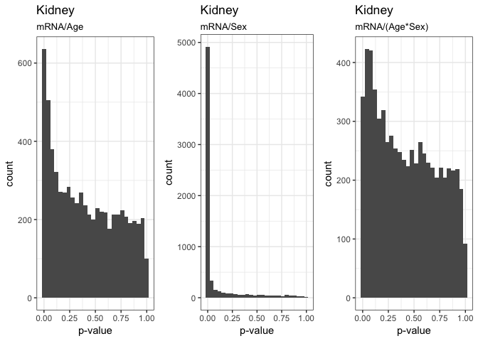
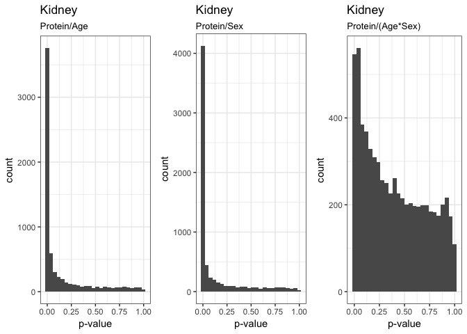

#  Histograms of ANOVA p-values

For each gene and protein from the kidney RNA-seq and shotgun proteomics dataset, we fitted a linear model
$$y_{i} \sim Age + Sex + Generation$$
and then tested the significance of the effects Age, Sex, and Age:Sex interaction. The firgures below visualizes the distirbution of the tests' p-values and compares them between the effects Age, Sex, and Age:Sex interaction.


```r
# mRNA - Age
pval_mRNA_age <- ggplot(data, aes(x=p.mRNA_Age.Sex)) +
    geom_histogram(binwidth=0.04) +
    theme_bw() +
    labs(title="Kidney",
         subtitle="mRNA/Age",
         x="p-value")
# protein - Age
pval_protein_age <- ggplot(data, aes(x=p.Prot_Age.Sex)) +
    geom_histogram(binwidth=0.04) +
    theme_bw() +
    labs(title="Kidney",
         subtitle="Protein/Age",
         x="p-value")
# mRNA - Sex
pval_mRNA_sex <- ggplot(data, aes(x=p.mRNA_Sex.Age)) +
    geom_histogram(binwidth=0.04) +
    theme_bw() +
    labs(title="Kidney",
         subtitle="mRNA/Sex",
         x="p-value")
# protein - Sex
pval_protein_sex <- ggplot(data, aes(x=p.Prot_Sex.Age)) +
    geom_histogram(binwidth=0.04) +
    theme_bw() +
    labs(title="Kidney",
         subtitle="Protein/Sex",
         x="p-value")
# mRNA - Age:Sex Interaction
pval_mRNA_int <- ggplot(data, aes(x=p.mRNA_Interaction)) +
    geom_histogram(binwidth=0.04) +
    theme_bw() +
    labs(title="Kidney",
         subtitle="mRNA/(Age*Sex)",
         x="p-value")
# protein - Age:Sex Interaction
pval_protein_int <- ggplot(data, aes(x=p.Prot_Interaction)) +
    geom_histogram(binwidth=0.04) +
    theme_bw() +
    labs(title="Kidney",
         subtitle="Protein/(Age*Sex)",
         x="p-value")
```

## Effects on mRNA

```r
grid.arrange(pval_mRNA_age, pval_mRNA_sex, pval_mRNA_int, ncol = 3)
```

<!-- -->

## Effects on protein 

```r
grid.arrange(pval_protein_age, pval_protein_sex, pval_protein_int, ncol =3)
```

<!-- -->


