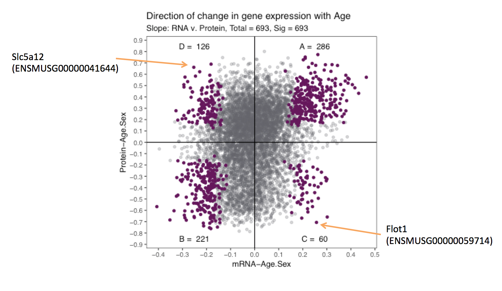

<span style="color:red">

**TO DO LIST:**

* upload data and scripts
* change paths to uploaded data

</span>
<br>

#\. Overall study design
We collected kidneys from 188 Diversity Outbred mice (93 females and 95 males) at 6, 12, and 18 months of age (63, 62, and 63 animals respectively). The right kidney was homogenized and an aliquot was used for RNA-sequencing and another for shotgun proteomics. A week prior to sacrifice, we also collected urine samples for renal physiological phenotyping (albumin, phosphate, and creatinine levels). 

```{r StudyDesign, echo=FALSE, out.width = '80%', fig.align = "center"}
knitr::include_graphics("images/StudyDesign.png")
```

#\. mRNA and protein that change with age
We fitted a linear model for all 6,667 genes with both mRNA and protein expression information. 

$$ y_{i} \sim Age + Sex + Generation $$
From linear model, we recorded slope and p-value generated from each mRNA and protein in the downstream processes. Additionally for a subset of genes with both mRNA and protein information, we also extracted the slope coefficient from.

##\. Running linear regression script
The following bash script is designed to submit an Rscript to a cluster that utilizes PBS submission. You must submit the .Rdata and name the output file in this order. 

The files needed are provided  <span style="color:red"> HERE:</span>

* DO188b_kidney_noprobs.RData
* anova_tests_slope_pairs.R
* Rsubmit_args.sh

```{bash qsub ANOVA analysis, eval= FALSE }
# Make sure correct paths and used and paste below into cluster to run:

qsub -v I="./Rdata/DO188b_kidney_noprobs.RData ./Anova_output/kidney_anova_slope_output.csv",script=anova_tests_slope_pairs Rsubmit_args.sh
```

##\. Histograms of p-values
The figures below visualizes the distribution of p-values that indicates whether the gene have significant changes in mRNA/protein as a result of age, sex, and age:sex interaction.

We found that sex effect on mRNA was stronger than the effects of Age, which is to be expected. We also saw that the proteins seem to be strongly affected by both sex and age.

```{r setup environment for ANOVA, echo=FALSE, message=FALSE}
# Setting up environment for ANOVA
# load libraries and data
library(tidyverse)
library(gridExtra)
data <- read_csv("~/Dropbox/TheAgingKidneyData/ANOVA/kidney_anova_slope_output.csv")
```

###\. Effects on mRNA
```{r ANOVA_sex_pval, echo = FALSE, fig.height = 5, fig.width= 10, fig.align = "center"}
# Generate mRNA - Age plot
pval_mRNA_age <- ggplot(data, aes(x=p.mRNA_Age.Sex)) +
    geom_histogram(binwidth=0.04) +
    theme_bw() +
    labs(title="Kidney",
         subtitle="mRNA/Age",
         x="p-value")

# Generate mRNA - Sex plot
pval_mRNA_sex <- ggplot(data, aes(x=p.mRNA_Sex.Age)) +
    geom_histogram(binwidth=0.04) +
    theme_bw() +
    labs(title="Kidney",
         subtitle="mRNA/Sex",
         x="p-value")

grid.arrange(pval_mRNA_age, pval_mRNA_sex, ncol =2)
```

##\. Effects on protein
```{r ANOVA_age_pval, echo = FALSE, fig.height = 5, fig.width= 10, fig.align = "center"}
# generate protein - Age plot
pval_protein_age <- ggplot(data, aes(x=p.Prot_Age.Sex)) +
    geom_histogram(binwidth=0.04) +
    theme_bw() +
    labs(title="Kidney",
         subtitle="Protein/Age",
         x="p-value")

# generate protein - Sex plot
pval_protein_sex <- ggplot(data, aes(x=p.Prot_Sex.Age)) +
    geom_histogram(binwidth=0.04) +
    theme_bw() +
    labs(title="Kidney",
         subtitle="Protein/Sex",
         x="p-value")

grid.arrange(pval_protein_age, pval_protein_sex, ncol = 2)
```

##\. Effects of Age:Sex interaction
```{r ANOVA_agesexInt_pval, echo = FALSE, fig.height = 5, fig.width= 10, fig.align = "center"}
# Generate mRNA - Age:Sex Interaction plot
pval_mRNA_int <- ggplot(data, aes(x=p.mRNA_Interaction)) +
    geom_histogram(binwidth=0.04) +
    theme_bw() +
    labs(title="Kidney",
         subtitle="mRNA/(Age*Sex)",
         x="p-value")

# Generate protein - Age:Sex Interaction plot 
pval_protein_int <- ggplot(data, aes(x=p.Prot_Interaction)) +
    geom_histogram(binwidth=0.04) +
    theme_bw() +
    labs(title="Kidney",
         subtitle="Protein/(Age*Sex)",
         x="p-value")

grid.arrange(pval_mRNA_int, pval_protein_int, ncol=2)
```

<br>
<br>

#\. Direction of Change with Age
We can illustrate the direction of change in mRNA and protein expression with age using the slope calculated from the linear model in the previous section.

```{r SlopePlot, echo = FALSE, message=FALSE, fig.height = 5, fig.width= 5, fig.align = "center"}
# Calculate and create plot using source
source("./Rsource/SlopePlot.R")
# show plot
print(SlopePlot)
```

<br>
<br>

In our manuscript, we used [clusterProfiler](http://bioconductor.org/packages/release/bioc/html/clusterProfiler.html) to identify enriched biological functions and pathways of each of the 4 significant cluster of genes. For more information please refer to our manuscript <span style="color:red"> HERE. (needs link)</span>
<br>
<br>

#\. The Ecological Fallacy
Previously we showed how mRNA and protein expression changed with age. We want to highlight a few genes to explain what is known as "The ecological fallacy", whereby the correlation of the total population is not the same as individual age group correlation.

```{r EcoFallacy_annotated, echo=FALSE, out.width = '90%'}

```

```{r Example Eco Fallacies, echo = FALSE, message= FALSE}
source("./Rsource/EcoFallacy.R")
```
<br>
We picked *Slc5a12* and *Flot1* as the best examples to demonstrate this ecological fallacy.  
<br>
```{r EcoFallacy_examples, echo = FALSE, message = FALSE, fig.height = 5, fig.width= 10, fig.align = "center"}
# Example from paper
grid.arrange(Slc5a12, Flot1, ncol=2)
```
<br>
At the whole population level, the mRNA expression of *Slc5a12* decreased with age and the protein expression increased with age. However, when broken down by age groups, the mRNA and protein expressions are positively correlated. When were compare between the age groups we do not see a shift between 6 month and 12 months, but at 18 months of age the average of the group shifts to the top right. The upward shift indicates that the protein expression increased but the leftward shift indicates the decrease of mRNA expression.

In contrast to *Slc5a12*, *Flot1* is an example where by the mRNA expression increases with age and the protein expression decreases with age at the whole population level. At the level of the individual age groups, we observe a bottom-right shift with an increase in age. The downward shift indicates a decrease in protein expression, and a rightward shift indicates a increase in mRNA expression with age.
<br>
<br>

#\. Relating changes in mRNA and protein to renal physiology

In addition to gene expression and protein expression quantification, we also measured metabolites in the urine samples (albumin, phosphate, and creatinine) collected from the same 188 animals 1 week prior to their sacrifice. 
From the analysis conducted in previous sections, we identified *Slc34a1*, *Slc34a3*, and *Lrp2* in group D to be of particular interest. Genes in group D have decreasing mRNA expression and increasing protein expression increasing with age at the whole population level. 

<br>

```{r phenotyp, echo = FALSE, message = FALSE, warning = FALSE}
# source file that contains code for plots below
source("./Rsource/Phenotype.R")
```

##\. *Slc34a1* and  *Slc34a3* expression levels
###\. Global level
*Slc34a1* and  *Slc34a3* each encode a phosphate co-transporter (NPT2C and NPT2A) in localized in the proximal tubule for phosphate reabsorption. For both genes we observe we confirmed global expression levels of decreasing mRNA and increasing protein levels for both females and males.
<br>
```{r Slc34 expression with age , echo = FALSE, message = FALSE, warning = FALSE, fig.height = 5, fig.width= 7, fig.align = "center"}
grid.arrange(Slca1_m,Slca1_p,Slca3_m,Slca3_p, ncol = 2)
```

###\. Individual age group level 
<br>
We also observe positive correlation between mRNA and protein levels at individual age groups. Both *Slc34a1* and  *Slc34a3* show a shift towards the top-left corner with increasing age, which is reflective of the observations made at the whole population level.
<br>
```{r Slc34 mrna vs protein expression, echo = FALSE, message = FALSE, warning = FALSE, fig.height = 3, fig.width= 7, fig.align = "center"}
grid.arrange(Slca1_mp,Slca3_mp, ncol = 2)
```

###\. *Slc34a1* and  *Slc34a3* compared to urinary phosphate levels
<br>
As expected for mediators of phosphate reabsorption, we confirmed an increase in *Slc34a1* and  *Slc34a3* both lead to decreasing levels of urinary phosphate levels.
<br>
```{r Slc34 with phoshate, echo = FALSE, message = FALSE, warning = FALSE, fig.height = 3, fig.width= 7, fig.align = "center"}
grid.arrange(Slca1_pPhos,Slca3_pPhos, ncol = 2)
```

##\. Lrp2 expression levels
###\. Global levels
<br>
*Lrp2* encodes for megalin, a receptor for albumin reabsorption also localized in the proximal tubule. 
Similar to *Slc34a1* and  *Slc34a3* the global levels of *Lrp2* mRNA and protein are respectively decreasing and increasing with age. 
<br>
```{r Lrp2 global, echo = FALSE, message = FALSE, warning = FALSE,fig.height = 3, fig.width= 7, fig.align = "center"}
grid.arrange(Lrp2_m,Lrp2_p, ncol = 2)
```

###\. Individual age group level 
<br>
We also observe the global trend reflected individually with age, driven by the top-left shift with increasing age. Additionally we also observe overall higher expression level of both *Lrp2* mRNA and protein in females (circle).  
<br>
```{r Lrp2 with age, echo = FALSE, message = FALSE, warning = FALSE,fig.height = 3, fig.width= 4, fig.align = "center"}
print(Lrp2_mp)
```

###\. *Lrp2* compared to urinary albumin levels
<br>
We were able to measure albumin levels form 120 DO mice. 90 of these mice had urinary albumin levels < 1 mg/dL and 67 animals had 0 mg/dL or below detection levels of urinary albumin. This lack of detectable albumin heavily skewed our data as it can be seen in the plot below. As these DO animals were not specifically genetically engineered to develop renal failure, we only expect a few animals with albuminuria. In our cohort of 188 DO mice, we have 5 animals with microalbuminuria (> 30 mg/dL of urinary albumin).
<br>
```{r Lrp2 and albumin, echo = FALSE, message = FALSE, warning = FALSE,fig.height = 3, fig.width= 4, fig.align = "center"}
print(Lrp2_pAlb)
```
<br>

#\. eQTL and pQTL to identifying age associated changes in expression.
<br> 
Using mRNA expression (eQTL) and protein expression (pQTL) as phenotypes in a quantitative trait loci (QTL) mapping approach, we were able to identify regions that regulate age/sex-associated changes in gene expression.
<br> 
For more information on QTL analyses, [Karl Broman](https://kbroman.org/)'s [R/qtl2](https://kbroman.org/qtl2/) [user guide](https://kbroman.org/qtl2/assets/vignettes/user_guide.html) is great resource for understanding and getting started with QTL scans.
<br> 

##\. Base R/qtl2 codes
<br> 
We calculated 3 different models of QTL: 

1. **Additive QTL** : Identifies loci that regulate gene expression.
2. **Sex-interactive QTL** : Identifies loci that regulate sex-associated changes in gene expression.
3. **Age-interactive QTL** : Identifies loci that regulate age-associated changes in gene expression.

Simplistically the **additive QTL** calculates an additive model that takes into account age, sex, generation of the animals as additive covariates. <br>
$$ Y_{i} \sim Age_{i} + Sex_{i} + Generatio_{i}n + QTL_{gi}$$
**Sex-interactive QTL** calculates two models, additive model and sex-interactive model, whereby the interactive model incorporates and interactive term for Sex. The sex interactive LOD scores are calculated by subtracting the additive model from the sex-interactive model. <br>
$$ Y_{i} \sim Age_{i} + Sex_{i} + Generation_{i} + QTL_{gi} + QTL_{gi} * Sex_{i}$$

<br>
**Age-interactive QTL** calculates two models, additive model and age-interactive model, whereby the interactive model incorporates and interactive term for Age. The age-interactive LOD scores are calculated by subtracting the additive model from the age-interactive model. <br>
$$ Y_{i} \sim Age_{i} + Sex_{i} + Generation_{i} + QTL_{gi} + QTL_{gi} * Age_{i}$$
<br>

In R, the the basic R/qtl2 code used for both additive and interactive QTL scan are below. 
```{r Basic QTL code, eval= FALSE }
# Load QTL2 library
library(qtl2)
library(qtl2convert)

# Load probs data
load("./RNAseq_data/DO188b_kidney.RData")

# Reformat from DOQTL format to meet qtl2 format specification
probs <- probs_doqtl_to_qtl2(genoprobs, snps, pos_column = "bp")
snps$chr <- as.character(snps$chr) 
snps$chr[snps$chr=="X"] <- "20" #change to numeric for creating map later
map <- map_df_to_list(map = snps, pos_column = "bp")

# Create matrix for each model
## Additive
addcovar <- model.matrix(~ Sex + Age + Generation, data=annot.samples)
## Sex-interactive
sex_intcovar <- model.matrix(~ Sex, data = annot.samples)
## Age-interactive
age_intcovar <- model.matrix(~ Age, data = annot.samples)

# scan additive model:
  LODadd <- scan1(genoprobs=probs,
               kinship=Glist,
               pheno=expr.protein[,p],
               addcovar=addcovar[,-1],
               cores=3,
               reml=TRUE)

# scan full model for age-interaction:
  LODint <- scan1(genoprobs=probs,
               kinship=Glist,
               pheno=expr.protein[,p],
               addcovar=addcovar[,-1],
               intcovar=age_intcovar[,-1], # replace with sex_intcovar for sex-interaction
               cores=3,
               reml=TRUE)
  
# get marker with maximum LOD score difference between full and additive scans:
  maxMarker <- function(full, add){
    diff <- as.data.frame(full)
    colnames(diff) <- "FullLOD"
    diff$AddLOD <- add[,1]
    diff$IntAgeLODDiff <- diff$FullLOD - diff$AddLOD
    max <- diff[which(diff$IntAgeLODDiff == max(diff$IntAgeLODDiff, na.rm = TRUE)[1])[1],]
    max$IntAgeChr <- str_split_fixed(rownames(max),"_",2)[,1]
    max$IntAgePos <- snps[snps$marker == rownames(max),]$bp
    return(max)
  }
  Max <- maxMarker(full = LODint, add = LODadd)
}

# output
output <- output %>% mutate(
  FullLOD = Max$FullLOD,
  AddLOD = Max$AddLOD,
  IntAgeChr = Max$IntAgeChr,
  IntAgePos = Max$IntAgePos,
  IntAgeLODDiff = Max$IntAgeLODDiff
)
```

##\. Additive eQTL and pQTL
<br>
For every mRNA and pQTL we have expression from, we calculated the additive eQTL and pQTL models. We plotted the genomic position of the highest LOD score (y-axis) in relation to the genomic position of the gene (y-axis) for genes with LOD scores > 7.5. <br>

We see strong clusters of eQTL and pQTL on the diagonal axis, indicating that a majority of gene expression are regulated locally (cis-QTL).<br>

```{r additive QTL, echo = FALSE, message = FALSE, warning = FALSE,fig.height = 7, fig.width= 10, fig.align = "center"}
library(grid)
source("./Rsource/eQTL_add.R")
source("./Rsource/pQTL_add.R")
pushViewport(viewport( layout = grid.layout(10,10)))
print(mPlot, vp = viewport(layout.pos.row = 1:8, layout.pos.col = 1:5))
print(pPlot, vp = viewport(layout.pos.row = 1:8, layout.pos.col = 6:10))
print(mdensity, vp = viewport(layout.pos.row = 9:10, layout.pos.col = 1:5))
print(pdensity, vp = viewport(layout.pos.row = 9:10, layout.pos.col = 6:10))
```

##\. Sex-interactive eQTL and pQTL
<br>
We plotted the sex-interactive eQTL and pQTL for genes with a LOD score > 7.5. Compared to the additive model, sex-associated changes in mRNA are less locally regulated, and we begin to see more distant eQTL peaks. Similarly sex-interactive pQTL show very little local regulation.<br>
<br>

```{r sex-interactive QTL, echo = FALSE, message = FALSE, warning = FALSE,fig.height = 7, fig.width= 10, fig.align = "center"}
library(grid)
source("./Rsource/eQTL_sexint.R")
source("./Rsource/pQTL_sexint.R")
pushViewport(viewport( layout = grid.layout(10,10)))
print(mPlot, vp = viewport(layout.pos.row = 1:8, layout.pos.col = 1:5))
print(pPlot, vp = viewport(layout.pos.row = 1:8, layout.pos.col = 6:10))
print(mdensity, vp = viewport(layout.pos.row = 9:10, layout.pos.col = 1:5))
print(pdensity, vp = viewport(layout.pos.row = 9:10, layout.pos.col = 6:10))
```

##\. Age-interactive eQTL and pQTL
<br>
We plotted the age-interactive eQTL and pQTL for genes with a LOD score > 7.5. Age-associated changes in gene and protein expression are mainly regulated by distant genes, and we begin to see dark vertical band. This vertical cluster of eQTL on distal chromosome 12, indicate that a gene/genes on chromosome 12 pleiotropically regulates the age-associated changes in mRNA expression of many genes. Similarly, in the pQTL global map, a distant band on distal chromosome 15 seem to have similar effects on age-associated changes in protein expression. <br>
<br>

```{r age-interactive QTL, echo = FALSE, message = FALSE, warning = FALSE,fig.height = 7, fig.width= 10, fig.align = "center"}
library(grid)
source("./Rsource/eQTL_ageint.R")
source("./Rsource/pQTL_ageint.R")
pushViewport(viewport( layout = grid.layout(10,10)))
print(mPlot, vp = viewport(layout.pos.row = 1:8, layout.pos.col = 1:5))
print(pPlot, vp = viewport(layout.pos.row = 1:8, layout.pos.col = 6:10))
print(mdensity, vp = viewport(layout.pos.row = 9:10, layout.pos.col = 1:5))
print(pdensity, vp = viewport(layout.pos.row = 9:10, layout.pos.col = 6:10))
```

#\. Session Information

```{r session-info, echo = FALSE}
print("Last updated:")
format(Sys.time(), '%d %B, %Y')
sessionInfo()
```
